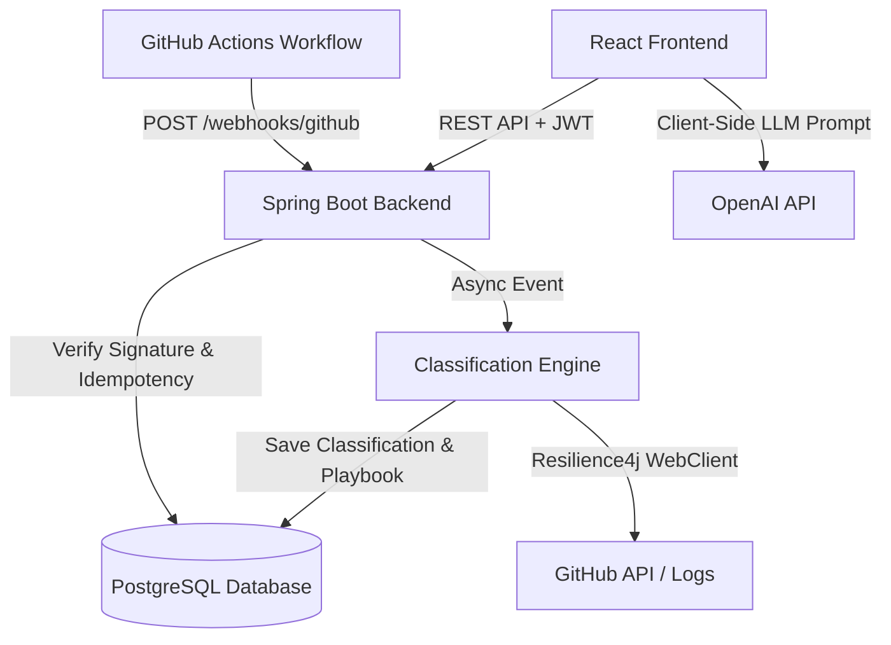

# IncidentOps — CI/CD Pipeline Incident Lifecycle & Classification Platform

IncidentOps is an enterprise-grade CI/CD incident management platform comprising a **Spring Boot 3 backend** and a **React 18 frontend**. It ingests GitHub Actions `workflow_run` webhooks, detects pipeline failures, manages incidents via a strict finite state machine, deterministically classifies root causes, recommends playbook actions, generates automated postmortems, and features an embedded **privacy-first Client-Side AI Advisor**.

---

## 🏗️ System Architecture



---

## ⚡ Key Features

- **Webhook Ingestion & Idempotency**: Secures webhooks with `X-Hub-Signature-256` HMAC-SHA256 verification and `X-GitHub-Delivery` header deduplication via `ProcessedDelivery`.
- **Async Deterministic Failure Classifier**: Processes logs on a dedicated thread pool (`classificationTaskExecutor`) into `BUILD_ERROR`, `TEST_FAILURE`, `DEPENDENCY_ERROR`, `TIMEOUT`, `INFRA_FLAKE`, or `UNKNOWN`.
- **Resilient External Integrations**: GitHub API client powered by WebFlux WebClient protected with **Resilience4j CircuitBreaker & RateLimiter**.
- **Finite State Machine & Optimistic Locking**: Strict transitions (`OPEN` → `INVESTIGATING` → `RESOLVED` / `IGNORED`) guarded by `@Version` optimistic locking to prevent race conditions.
- **Automated Postmortems**: Generates structured postmortems from incident event logs once resolved or ignored.
- **React Frontend & Embedded AI Advisor**: Modern SPA (Vite + React + Tailwind CSS) with a privacy-first AI Advisor panel that prompts OpenAI directly from the browser without exposing keys to the backend.

---

## 📁 Repository Structure

```
IncidentOps/
├── backend/                  # Spring Boot 3.3.4 (Java 21) backend application
│   ├── src/                  # Main Java code & test suite (24 unit & integration tests)
│   ├── Dockerfile            # Multi-stage production container build
│   └── pom.xml               # Maven configuration
└── frontend/                 # React 18 + Vite + Tailwind CSS frontend application
    ├── src/                  # Components, Pages, API Client, and Types
    ├── package.json          # Node dependencies
    └── vite.config.ts        # Vite build & proxy settings
```

---

## 🚀 Live Demo & Quickstart

### Live Demo Instructions
- **Deployed Frontend (Vercel)**: `https://incidentops.vercel.app` *(configured)*
- **Deployed Backend API (Render)**: `https://incidentops-backend.onrender.com`
- **Demo Credentials**: 
  - **Username**: `admin`
  - **Password**: `password123`

#### Live Webhook Failure Walkthrough
1. Navigate to the demo repository on GitHub: `https://github.com/incidentops-demo/sample-app`
2. Go to **Actions** tab → Select **CI Pipeline** → Click **Run workflow**.
3. Choose the `fail-build` or `fail-test` branch to trigger an intentional build failure.
4. Open the **IncidentOps Frontend** at the Incident List page.
5. Watch a new `OPEN` incident appear within seconds via automated webhook ingestion and async failure classification.
6. Click the incident to view root-cause classification, matched log excerpt, and playbook recommendations.
7. Paste your OpenAI API key in the **AI Advisor Panel** to receive direct browser-to-LLM remediation steps.

---

## 💻 Local Development Setup

### Prerequisites
- **Java 21 JDK**
- **Node.js 18+** & `npm`
- **Docker Desktop** (optional, for Testcontainers) or **PostgreSQL 16**

### 1. Run Backend
```bash
cd backend
mvn spring-boot:run
```
The backend starts on `http://localhost:8080`.
- **Swagger UI**: [http://localhost:8080/swagger-ui.html](http://localhost:8080/swagger-ui.html)
- **OpenAPI Spec**: [http://localhost:8080/v3/api-docs](http://localhost:8080/v3/api-docs)

### 2. Run Frontend
```bash
cd frontend
npm install
npm run dev
```
The frontend starts on `http://localhost:5173`. Requests to `/api`, `/incidents`, and `/webhooks` are proxied to the Spring Boot backend.

### 3. Run Backend Test Suite
```bash
cd backend
mvn clean test
```
Executes all 24 unit and integration tests (including Testcontainers PostgreSQL, WireMock, state machine, and JWT auth tests).

---

## 🐳 Containerization & Production Deployment

### Docker Multi-Stage Build
Build the optimized JRE runtime container image:
```bash
cd backend
docker build -t incidentops-backend:latest .
```

### Environment Variables

| Variable | Default / Example | Purpose |
|---|---|---|
| `SPRING_DATASOURCE_URL` | `jdbc:postgresql://postgres:5432/incidentops` | PostgreSQL Connection String |
| `SPRING_DATASOURCE_USERNAME` | `postgres` | Database Username |
| `SPRING_DATASOURCE_PASSWORD` | `postgres` | Database Password |
| `JWT_SECRET` | `256-bit-hex-secret-key` | JWT Signing Secret |
| `GITHUB_WEBHOOK_SECRET` | `webhook-secret-key` | GitHub Webhook HMAC Secret |
| `CORS_ALLOWED_ORIGINS` | `http://localhost:5173,https://incidentops.vercel.app` | Allowed CORS Frontend Origins |
| `ADMIN_USERNAME` | `admin` | Login username for the application |
| `ADMIN_PASSWORD` | `password123` | Login password for the application |
